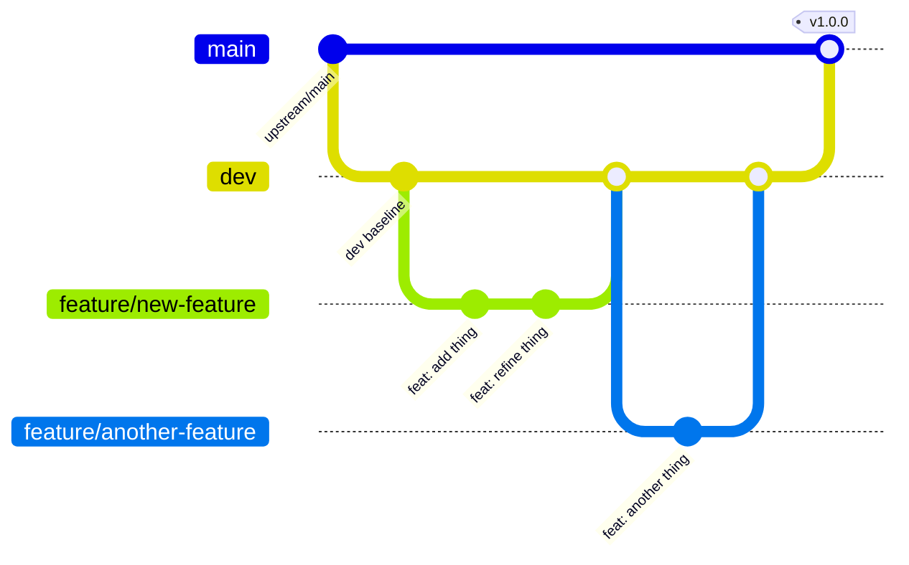

modrev-ai Deployment Strategy

## Overview
This document outlines the git workflow for the modrev-ai fork of Cline, designed to maintain a clean separation between development, testing, and production while allowing controlled synchronization with the upstream Cline repository.

## Branch Structure

### Permanent Branches (Never Deleted)
| Branch | Purpose | Source of Truth |
|--------|---------|-----------------|
| `main` | Production-ready code | Receives merges from `dev`; syncs with `upstream/main` on demand |
| `dev` | Development & testing | Receives merges from feature branches; merges into `main` for releases |

### Temporary Branches
| Branch | Purpose | Lifecycle |
|--------|---------|-----------|
| `feature/*` | New features, bug fixes, experiments | Created from `dev`; merged back to `dev`; deleted after merge |
| `hotfix/*` | Urgent production fixes | Created from `main`; merged to both `main` and `dev`; deleted after merge |

---

## Workflow Diagrams

### Standard Feature Development


### Hotfix Flow
```mermaid
gitGraph
    commit id: "v1.0.0" tag: "v1.0.0"
    branch hotfix/critical-bug
    checkout hotfix/critical-bug
    commit id: "fix: critical bug"
    checkout main
    merge hotfix/critical-bug tag: "v1.0.1"
    checkout dev
    merge hotfix/critical-bug
```

### Upstream Sync Flow
```mermaid
gitGraph
    commit id: "local main"
    checkout main
    merge upstream/main id: "sync upstream"
    checkout dev
    merge main
```

---

## Standard Operating Procedures

### 1. Starting New Work (Feature Branch)
```bash
# Ensure dev is up to date
git checkout dev
git pull origin dev

# Create feature branch from dev
git checkout -b feature/your-feature-name

# Work, commit, push
git add .
git commit -m "feat: your descriptive message"
git push origin feature/your-feature-name
```

### 2. Merging Feature to Dev (via PR or Direct)
**Option A: Pull Request (Recommended for team)**
```bash
# Push feature branch, create PR targeting dev
git push origin feature/your-feature-name
# Create PR on GitHub: feature/your-feature-name -> dev
# Review, approve, merge (squash or merge commit)
# Delete feature branch after merge
```

**Option B: Direct Merge (Solo/small changes)**
```bash
git checkout dev
git pull origin dev
git merge feature/your-feature-name
git push origin dev
git branch -d feature/your-feature-name
git push origin --delete feature/your-feature-name
```

### 3. Releasing Dev to Main (Production Deploy)
```bash
# Ensure dev is stable and tested
git checkout dev
git pull origin dev

# Merge to main
git checkout main
git pull origin main
git merge dev --no-ff -m "release: vX.Y.Z from dev"

# Tag the release (modrev convention: upstream version + modrev suffix)
git tag -a vX.Y.Z-modrev.N -m "Release vX.Y.Z-modrev.N"

# Push main and tags
git push origin main
git push origin --tags

# Create GitHub Release
gh release create vX.Y.Z-modrev.N --title "vX.Y.Z-modrev.N" --notes "Modrev fork release based on Cline vX.Y.Z with modrev customizations."
```

### 4. Syncing with Upstream (Public Cline Updates)
**When you want to pull upstream changes:**
```bash
# 1. Fetch latest upstream
git fetch upstream

# 2. Review what's new (optional)
git log --oneline main..upstream/main

# 3. Merge upstream into main
git checkout main
git merge upstream/main -m "sync: merge upstream/main"

# 4. Push updated main to your fork
git push origin main

# 5. Bring dev up to speed with main
git checkout dev
git merge main
git push origin dev
```

**Automated sync script (optional):**
```bash
#!/bin/bash
# sync-upstream.sh
set -e

echo "Fetching upstream..."
git fetch upstream

echo "Merging upstream/main into main..."
git checkout main
git merge upstream/main -m "sync: merge upstream/main $(date +%Y-%m-%d)"

echo "Pushing main to origin..."
git push origin main

echo "Updating dev..."
git checkout dev
git merge main
git push origin dev

echo "Sync complete!"
```

### 5. Hotfix Production Issue
```bash
# Create hotfix from main
git checkout main
git pull origin main
git checkout -b hotfix/critical-issue

# Fix the issue
git add .
git commit -m "fix: critical production issue"

# Merge to main (production)
git checkout main
git merge hotfix/critical-issue --no-ff -m "hotfix: critical issue"
git tag -a vX.Y.Z -m "Hotfix vX.Y.Z"
git push origin main
git push origin --tags

# Merge to dev
git checkout dev
git merge hotfix/critical-issue
git push origin dev

# Cleanup
git branch -d hotfix/critical-issue
git push origin --delete hotfix/critical-issue
```

---

## Branch Protection Rules (GitHub Settings)

### `main` Branch
- Require pull request reviews before merging
- Require status checks to pass (CI)
- Require branches to be up to date before merging
- Include administrators
- Restrict pushes to matching branches only
- Allow force pushes: **NO**
- Allow deletions: **NO**

### `dev` Branch
- Require pull request reviews before merging (optional for solo)
- Require status checks to pass (CI)
- Allow force pushes: **NO**
- Allow deletions: **NO**

---

## Versioning Strategy

### Semantic Versioning (SemVer)
- **MAJOR**: Breaking changes, major rewrites
- **MINOR**: New features, backward compatible
- **PATCH**: Bug fixes, backward compatible

### Tag Format (modrev convention)
```
v<MAJOR>.<MINOR>.<PATCH>-modrev.<N>
v4.1.3-modrev.1    # First modrev release based on upstream v4.1.3
v4.1.3-modrev.2    # Second modrev release (same upstream base)
v4.2.0-modrev.1    # New upstream minor version
```

### Release Notes
Generate from commit messages since last tag:
```bash
git log v1.0.0..HEAD --pretty=format:"- %s (%an)" --reverse
```

---

## CI/CD Integration Points

### On Push to `dev`
- Run full test suite
- Build extension/package
- Deploy to staging/test environment
- Run integration tests

### On Push to `main`
- Run full test suite
- Build production artifacts
- Create GitHub Release with artifacts
- Deploy to production (if applicable)
- Publish to marketplace (VS Code, etc.)

### On Tag Push (`v*`)
- Trigger release workflow
- Publish to registries
- Update changelog

---

## Conflict Resolution Guidelines

### Feature Branch Conflicts with Dev
```bash
git checkout feature/your-feature
git fetch origin
git rebase origin/dev
# Resolve conflicts
git rebase --continue
git push --force-with-lease origin feature/your-feature
```

### Dev Conflicts with Main (During Release)
```bash
git checkout dev
git merge main
# Resolve conflicts (should be minimal if hotfixes flow correctly)
git commit
git push origin dev
```

### Upstream Sync Conflicts
```bash
git checkout main
git merge upstream/main
# Resolve conflicts - prefer upstream for upstream-owned files
# Keep local changes for modrev-specific customizations
git commit
git push origin main
```

---

## Quick Reference Card

| Action | Command |
|--------|---------|
| Start new feature | `git checkout dev && git pull && git checkout -b feature/xyz` |
| Finish feature | `git checkout dev && git pull && git merge feature/xyz && git push` |
| Release to prod | `git checkout main && git merge dev --no-ff && git tag vX.Y.Z-modrev.N && git push origin main --tags` |
| Sync upstream | `git fetch upstream && git checkout main && git merge upstream/main && git push && git checkout dev && git merge main && git push` |
| Hotfix | `git checkout main && git checkout -b hotfix/xyz && ...fix... && git checkout main && git merge hotfix/xyz && git checkout dev && git merge hotfix/xyz` |
| View branches | `git branch -a` |
| View sync status | `git log --oneline main..upstream/main` |

---

## Notes & Best Practices

1. **Never commit directly to `main` or `dev`** - Always use feature branches
2. **Keep feature branches short-lived** - Merge within days, not weeks
3. **Sync upstream regularly** - At least before each release, ideally weekly
4. **Use descriptive commit messages** - Follow conventional commits: `feat:`, `fix:`, `docs:`, `refactor:`, `test:`, `chore:`
5. **Test on `dev` before merging to `main`** - `dev` is your staging ground
6. **Document modrev-specific customizations** - Keep a `MODREV_CUSTOMIZATIONS.md` to track what differs from upstream
7. **Automate where possible** - Use GitHub Actions for CI, release automation, and upstream sync scheduling

---

## Release History

### v4.1.3-modrev.1 (2026-08-04)
- **Base**: Upstream Cline v4.1.3 (commit 2a0dd197b)
- **Changes**: Added MODREV_DEPLOYMENT_STRATEGY.md with git workflow documentation
- **PR**: #3 (dev → main)
- **Tag**: v4.1.3-modrev.1
- **GitHub Release**: https://github.com/modrev-ai/cline/releases/tag/v4.1.3-modrev.1

---

## File Locations
- This strategy: `MODREV_DEPLOYMENT_STRATEGY.md`
- Customizations tracking: `MODREV_CUSTOMIZATIONS.md` (create as needed)
- Sync script: `scripts/sync-upstream.sh` (create as needed)